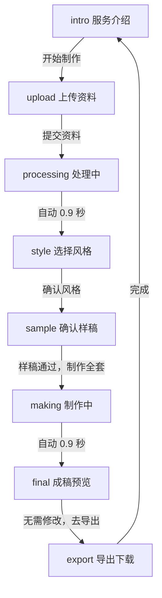
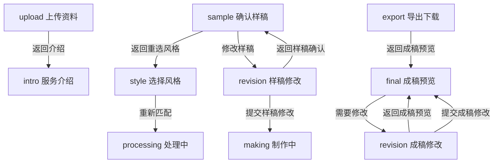

# 最新网页设计原型与对外页面备份汇总

更新时间：2026-07-04

本文档是当前仓库的网页设计、原型流程、页面跳转逻辑、设计参考和对外发布界面的统一备份索引。后续查看或交接时，以本文档列出的“当前唯一有效版本”为准。

## 当前唯一有效版本

| 类型 | 最新文件 | 用途 |
| --- | --- | --- |
| 对外网页入口 | `index.html` | PPT 制作助手公开预览页入口 |
| 页面样式 | `css/style.css` | 当前桌面端视觉样式、布局、按钮、卡片和响应状态 |
| 页面交互 | `js/main.js` | 单页应用的页面状态、跳转逻辑、表单状态、内容生成和文件导出 |
| 本地依赖 | `js/vendor/` | PPTX、PDF 导出所需的浏览器端依赖 |
| 项目说明 | `README.md` | 线上地址、本地运行、部署和主要文件 |
| 制作规范 | 内部操作文档 | PPT 制作工作流和人工执行规则 |
| 备份汇总 | `LATEST_WEB_DESIGN_BACKUP.md` | 最新网页设计与版本去重索引 |

## 对外网页界面

当前对外页面是一个静态单页网页，面向真实用户展示 PPT 制作服务流程。页面名称为“PPT 制作助手”，核心承诺是“从资料到成稿导出”。

线上地址：

- https://702129770-lgtm.github.io/gzl/

本地预览：

```bash
python3 -m http.server 4173
```

打开：

```text
http://localhost:4173
```

当前能力：

- 仅保留桌面网页版，建议 1280px 及以上宽度访问。
- 当前版本为纯前端静态网页，不会真实上传用户文件。
- TXT、MD、CSV、JSON 文件会在浏览器本地读取，PDF、PPT、Word 和图片会作为附件信息记录。
- 页面会基于资料生成样稿、完整成稿页面、每页讲稿提示，并导出真实 PPTX、PDF 和讲稿文本。
- PPTX、PDF 依赖已本地化到 `js/vendor/`，对外页面不依赖第三方 CDN 运行导出。

## 网页设计原型

当前原型采用“单页应用 + 状态切换”的方式实现，所有页面内容由 `js/main.js` 渲染到 `#screen-area`。

页面模块：

| 页面 ID | 页面名称 | 用户看到的核心内容 |
| --- | --- | --- |
| `intro` | 服务介绍 | 介绍上传资料、确认样稿、导出成稿三步流程 |
| `upload` | 上传资料 | 填写项目名称、使用场景、目标观众、页数、资料链接和文件入口 |
| `processing` | 处理中 | 模拟资料整理和模板匹配 |
| `style` | 选择风格 | 提供 3 个预设设计方向和 1 个自定义风格 |
| `sample` | 确认样稿 | 展示按已选模板方向生成的完整样稿、页面结构和确认后的动作 |
| `revision` | 修改反馈 | 收集样稿或成稿的修改区域、强度和说明 |
| `making` | 制作中 | 模拟完整 PPT 制作 |
| `final` | 成稿预览 | 展示完整成稿页面结构 |
| `export` | 导出下载 | 提供 PPTX、PDF、讲稿三个交付入口 |

## 网页跳转逻辑

当前跳转逻辑集中在 `js/main.js` 的 `handlePrimary`、`handleSecondary`、`goTo` 和 `tertiaryAction` 事件中。

主流程：



返回与修改流程：



关键状态：

| 状态字段 | 说明 |
| --- | --- |
| `state.screen` | 当前页面 ID |
| `state.projectName` | 项目名称 |
| `state.useCase` | 使用场景 |
| `state.audience` | 目标观众 |
| `state.referenceLinks` | 线上资料链接 |
| `state.materials` | 手填文案和内容要点 |
| `state.pageCount` | 页数预期 |
| `state.selectedOutputs` | 用户选择的输出格式 |
| `state.attachedFiles` | 附件文件摘要 |
| `state.extractedText` | 本地读取的文本资料 |
| `state.selectedStyle` | 当前选中的设计风格 |
| `state.customStyleDescription` | 自定义风格描述 |
| `state.revisionMode` | 修改模式，区分样稿修改和成稿修改 |
| `state.revisionArea` | 修改区域 |
| `state.revisionLevel` | 修改强度 |
| `state.revisionText` | 修改说明 |
| `state.deckPages` | 生成后的 PPT 页面结构 |
| `state.exportRecords` | 当前浏览器最近导出记录 |

## 网页设计参考

当前设计参考已经收敛为 4 个可选方向，统一写在 `js/main.js` 的 `styles` 数组中。前三个为预设设计方向，第四个为自定义。

| 风格 ID | 风格名称 | 来源 / 适用场景 | 设计取向 |
| --- | --- | --- | --- |
| `profile` | 企业介绍模板 | 公司介绍、可信背书 | 蓝色建筑底图、双语标题、大面积留白 |
| `product` | 产品推广方案 | 产品介绍、发布会、客户提案 | 白底、蓝色侧栏、产品图占位 |
| `pitch` | 商业计划书通用模板 | 商业计划、融资路演、方案汇报 | 建筑实景、青蓝标题、商务目录结构 |
| `custom` | 自定义风格 | 用户已有明确方向 | 由用户描述视觉感觉，再进入样稿确认 |

视觉系统：

| 项目 | 当前设置 |
| --- | --- |
| 主色 | `#533afd` |
| 辅助强调色 | `#ea2261` |
| 背景色 | `#f6f9fc` |
| 文本色 | `#061b31` |
| 字体 | Source Sans 3、Source Code Pro、系统中文字体 |
| 圆角 | 主要卡片 8px，输入框和按钮 6px |
| 布局 | 桌面端固定最小宽度，居中容器，顶部进度条，主体工作区 |

## 预览截图备份

当前仓库保留了 3 张预览截图，可作为最新页面视觉备份：

| 文件 | 用途 |
| --- | --- |
| `.preview-desktop.png` | 桌面端页面预览 |
| `.preview-builder-layout.png` | 构建或布局检查截图 |
| `.preview-result-viewport.png` | 最终视口结果截图 |

这些截图不是独立版本，不参与页面运行；它们只作为当前网页界面的视觉备份。

## 重复版本清理结论

已检查当前仓库文件：

- 没有发现内容哈希完全相同的重复文件。
- 网页实现只保留一套最新版本：`index.html`、`css/style.css`、`js/main.js`。
- 旧的制作流程说明没有并入网页代码，保留为内部规范文档。
- 隐藏预览截图属于视觉备份，不视为重复网页版本。
- Git 历史中的旧提交仅作为版本记录保留，不改写历史。

## 后续更新规则

为了避免再次产生重复版本，后续更新按以下规则执行：

1. 页面结构只改 `index.html`。
2. 视觉样式只改 `css/style.css`。
3. 页面状态、跳转和导出模拟只改 `js/main.js`。
4. 网页设计、跳转逻辑或对外页面有变化时，同步更新本文档。
5. 不再新增 `final`、`new`、`latest`、`v2` 等命名的重复页面文件。
6. 如需保留旧方案，只通过 Git 提交记录保留，不复制成新文件。
