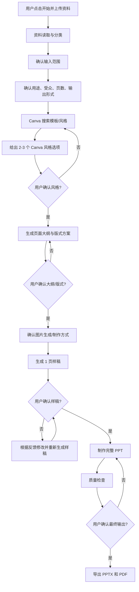

# Canva 优先 PPT 制作工作流操作文档

## 1. 文档目的

本文档用于把“资料输入 -> Canva 风格选择 -> 样稿确认 -> PPT/PDF 输出”的 PPT 制作流程标准化，方便团队成员、外包设计师或自动化执行者按照统一流程完成 PPT 制作。

适用场景：

- 单页人物介绍、CEO 介绍、团队介绍
- 品牌客户提案
- 产品介绍
- 融资路演
- 项目汇报
- 培训课件

核心原则：

- Canva 优先：风格与模板方向优先从 Canva 获取。
- 用户确认关键决策：用途、受众、风格、样稿、最终输出必须确认。
- 资料只按用途使用：用户明确说明“不参考设计/Logo/样张”时，只提取文字和素材内容。
- 先样稿，后全套：未确认样稿前，不制作完整 PPT。

## 2. 工作流总览



## 3. 角色分工

### 用户

负责提供：

- 原始资料：文档、截图、图片、视频、数据、已有 PPT 等
- 使用目的：例如 CEO 介绍、品牌客户提案、融资路演
- 目标观众：例如品牌客户、投资人、内部管理层
- 输出要求：页数、语言、是否需要讲稿、是否需要 PDF
- 关键确认：Canva 风格、页面大纲、样稿、最终输出

### 执行者

负责完成：

- 资料读取、内容提炼、素材分类
- Canva 模板/风格搜索
- 风格选项整理
- 页面结构设计
- 样稿生成
- PPT 制作和美化
- PPTX/PDF 导出
- 质量检查和版本交付

## 4. 输入资料处理规则

收到资料后，先按以下类型分类：

| 类型 | 处理方式 |
| --- | --- |
| 文档 | 提取主题、结构、关键观点、可用文案 |
| 图片 | 判断是内容素材、人物素材、产品素材、Logo 还是风格参考 |
| 视频 | 提取可用画面、核心信息、截图建议 |
| 截图 | 先确认用途：内容读取、视觉参考、样张参考或全部使用 |
| 样张 | 仅在用户允许时作为设计参考 |
| Logo | 仅在用户允许时使用 |
| 旧 PPT | 先确认是内容来源、风格来源，还是两者都是 |

特殊约束示例：

> 用户说“只读取截图中的文本和图片，不要参考样张和 Logo 和 PPT 设计”时，执行者只能读取截图里的文字和可用图片素材，不得复用原截图的版式、配色、Logo、装饰元素或页面设计。

## 5. 必须确认的信息

在进入 Canva 搜索或样稿制作前，应确认以下信息。

### 基础确认

- PPT 用途
- 目标观众
- 页数或是否由执行者自动判断
- 输出格式：PPTX、PDF，是否需要讲稿
- 语言：中文、英文或中英双语

### 素材确认

- 哪些素材必须使用
- 哪些素材只是参考
- 是否可以改写原文
- 是否可以补充表达或重组逻辑
- 是否允许使用截图/视频中的人物、产品、图表

### 制作确认

- Canva 模板/风格方向
- 页面大纲
- 样稿
- 最终版本

确认话术示例：

```text
我已读取资料。请确认：
1. 这套 PPT 的用途是：[用途]
2. 目标观众是：[观众]
3. 页数为：[页数/自动判断]
4. 输出为：[PPTX/PDF/是否讲稿]
5. 以下素材为必须使用：[素材列表]
确认后我会从 Canva 搜索模板/风格，并给出 2-3 个选项。
```

## 6. Canva 使用规则

### 优先级

1. 优先使用 Canva 品牌模板或演示文稿模板。
2. 如果可直接基于模板生成，则优先基于模板生成。
3. 如果模板不能自动生成，则将 Canva 模板作为强风格参考。
4. 如果 Canva 账号权限不足或搜索无结果，应说明原因，并改用 Canva 公开模板分类或用户提供的 Canva 链接作为参考。

### Canva 风格选项输出格式

每个风格选项必须包含：

- 风格名称
- Canva 来源或搜索方向
- 适合场景
- 视觉特点
- 色彩方向
- 版式特点
- 为什么适合本次 PPT
- 风险或不适合点

示例：

```text
A. 高可信创始人 Profile 风（推荐）
来源：Canva Profile / Company Presentation 模板方向
特点：左侧人物、右侧履历与能力背书，专业、克制、可信。
适合：CEO 介绍、品牌客户提案、团队背书页。
风险：视觉冲击力不如路演风，但更稳重。
```

## 7. 样稿制作规则

样稿是完整制作前的关键确认节点。

样稿要求：

- 只生成 1 页代表性页面
- 必须体现已确认的 Canva 风格方向
- 必须使用已确认的核心内容和必要素材
- 中文文本要清晰、准确、无乱码
- 不添加未授权 Logo、水印、页码或虚构信息

样稿确认问题：

```text
请确认：
1. 风格是否通过？
2. 信息密度是否合适？
3. 图片/人物/素材处理是否可接受？
4. 是否需要更商务、更科技、更简洁或更有视觉冲击力？
确认后我再制作最终 PPTX 和 PDF。
```

## 8. 完整制作规则

样稿通过后，执行者可以制作完整 PPT。

制作内容包括：

- 页面拆分
- 文案精炼
- 版式设计
- 视觉统一
- 图片处理
- 信息图/卡片/图表设计
- PPT 组装
- PDF 导出

对于多页 PPT，应保持统一视觉系统，但不要每页使用完全相同的布局。

## 9. 质量检查清单

交付前必须检查：

- 内容是否符合用户确认的大纲
- 是否使用了正确的 Canva 风格方向
- 是否误用了用户禁止参考的样张、Logo 或旧 PPT 设计
- 中文是否准确，无乱码、错别字、截断
- 人名、公司名、数字、英文缩写是否正确
- 页面是否有明显遮挡、重叠、溢出
- 图片是否清晰
- PPTX 是否能打开
- PDF 是否成功导出

## 10. 异常处理

### Canva 权限不足

处理方式：

- 明确说明 Canva 模板搜索或品牌模板功能受限
- 尝试搜索用户已有/共享设计
- 如仍无结果，使用 Canva 公开模板分类或让用户提供 Canva 模板链接

说明话术：

```text
当前 Canva 账号无法使用品牌模板搜索/自动生成能力。我会改为使用 Canva 公开模板方向作为风格来源，或你可以提供一个 Canva 模板链接让我基于它继续。
```

### 资料不足

处理方式：

- 明确列出缺少的信息
- 让用户补充，或由执行者给出默认假设并请求确认

### 用户多次修改风格

处理方式：

- 保留最新确认版本为准
- 修改样稿，不直接进入全套制作

### 素材版权或品牌限制

处理方式：

- 不擅自加入第三方 Logo、品牌素材或人物照片
- 用户明确授权后再使用

## 11. 单页 CEO 介绍示例流程

适用输入：

- 一张含人物头像和文字信息的截图
- 用户要求：只读取文本和图片，不参考设计
- 用途：CEO 介绍
- 观众：品牌客户
- 页数：1 页

执行步骤：

1. 提取截图文字和人物头像信息。
2. 明确不参考原截图版式、颜色、Logo 和 PPT 设计。
3. 从 Canva 搜索 Profile / Company / Founder Introduction 风格方向。
4. 给出 2-3 个风格选项。
5. 用户选择“高可信创始人 Profile 风”。
6. 用户补充视觉要求，例如“浅紫色科技风”。
7. 生成 1 页样稿。
8. 用户确认后导出 PPTX 和 PDF。

## 12. 推荐交付物

最终应交付：

- `.pptx` 源文件
- `.pdf` 演示文件
- 可选：每页讲稿或备注
- 可选：使用的 Canva 风格说明
- 可选：素材使用说明

## 13. 可复用启动模板

用户以后可以这样发起：

```text
开始制作 PPT。
我会上传资料，请先检查资料和用途。
请优先从 Canva 搜索合适的 PPT 模板/风格，给我 2-3 个选项。
我确认 Canva 方向和样稿后，再制作完整 PPT，并输出 PPTX 和 PDF。

资料使用限制：
[例如：只读取截图中的文本和图片，不要参考样张、Logo 和原 PPT 设计]

用途：
[填写用途]

目标观众：
[填写观众]

页数：
[填写页数或自动判断]
```

